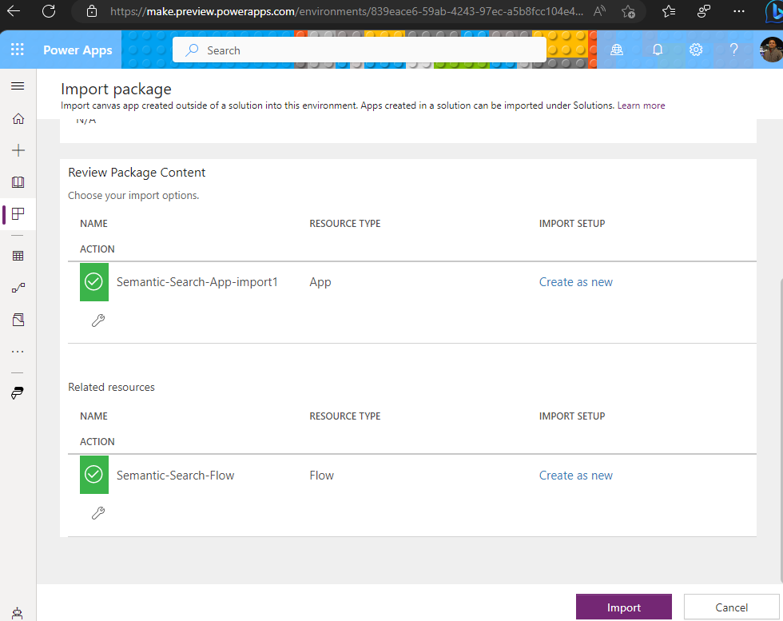
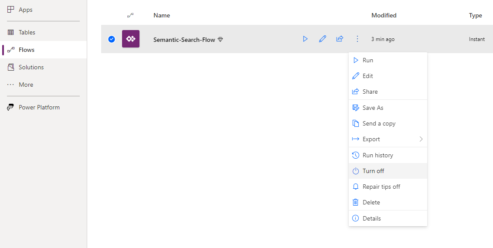

# Build Open AI Application on Power App to allow users to use natural language question on top of SQL data
### Summary.

This scenario allows users to use Open AI as an intelligent agent to get business questions prompts from end users and generating SQL queries from the prompts.This implementation scenario focuses on building a Nautual Language to query from business questions and genarte the queries for database retrieval 
### Architecture Diagram

### Solution Flow

Step 1: Context information is provided to system through a Power App form, this information is submitted to Azure function

Step 2: Azure Open AI engine converts the user context prompt to SQL query and passes the query to Azure function

Step 3: Azure function passes the context information to Open AI Engine to convert the user context information prompt to SQL Query

Step 4: The Azure function passes the genrated SQL query text and executes the query on Azure SQL databse 

Step 5: The query is executed on SQL database and results are returned to Azure function

Step 6: Azure function returns the results to end user 

## 1. Azure services deployment

Deploy Azure Resources namely - Azure Function App to host facade for OpenAI and Search APIs, Azure Search Service and a Azure Form Recognizer resource.

Here are the SKUs that are needed for the Azure Resources:

- Azure Function App - Consumption Plan
- Azure Cognitive Search - Standard (To support semantic search)
- Azure Forms Recognizer - Standard (To support analyzing 500 page document)
- Azure Storage - general purpose V1 (Needed for Azure Function App and uploading sample documents)

The Azure Function App also deploys the function code needed for powerapps automate flow. 

- Step 1: Setup Azure Cognitive Search and prepare data

    As part of data preperation step, to work in Open AI, the documents are chunked into smaller units(20 lines) and stored as individual documents in the search index. The chunking steps can be achieved with a python script below. 
    To make it easy for the labs, the sample document has already been chunked and provided in the repo. 

    * Enable Semantic Search on Azure Portal. Navigate to Semantic Search blade and select Free plan. 
    
        

    *   Create Search Index, Sematic Configuration and Index a few documents using automated script. The script can be run multiple times without any side effects.
        Run the below commands from cmd prompt to conifgure python environment. Conda is optional if running in Azure Cloud Shell or if an isolated python environment is needed. 

            
            git clone <repo>
            cd OpenAIWorkshop\scenarios\openai_on_custom_dataset
            conda create env -n openaiworkshop python=3.9
            conda activate openaiworkshop
            pip install -r .\orchestrator\requirements.txt

    *   Update Azure Search, Open AI endpoints, AFR Endpoint and API Keys in the secrets.env. 
        Rename secrets.rename to secrets.env. (This is recommended to prevent secrets from leaking into external environments.)
        The secrets.env should be placed in the ingest folder along side the python script file search-indexer.py.
        The endpoints below needs to have the trailing '/' at end for the search-indexer to run correctly.

            AZURE_OPENAI_API_KEY=""
            AZURE_OPENAI_ENDPOINT="https://<>.openai.azure.com/"
            AZURE_OPENAI_API_KEY_EASTUS=""
            AZURE_OPENAI_ENDPOINT_EASTUS="https://<>.openai.azure.com/"

            AZSEARCH_EP="https://<>.search.windows.net/"
            AZSEARCH_KEY=""
            AFR_ENDPOINT="https://westus2.api.cognitive.microsoft.com/"
            AFR_API_KEY=""
            INDEX_NAME="azure-ml-docs"

    *   The document processing, chunking, indexing can all be scripted using any preferred language. 
        This repo uses Python. Run the below script to create search index, add semantic configuration and populate few sample documents from Azure doc. 
        The search indexer chunks a sample pdf document(500 pages) which is downloaded from azure docs and chunks each page into 20 lines. Each chunk is created as a new seach doc in the index. The pdf document processing is achieved using Azure Form Recognizer service. 
     

            cd .\scenarios\openai_on_custom_dataset\ingest\
            python .\search-indexer.py
            

    *   Optional Manual Approach. If you prefer to not use the python/automated approach above, the below steps can be followed without automation script. 
        To configure Azure Search, please follow the steps below

        - In the storage container, that is created as part of the template in step 1, create a blob container. 
        - Extract the data files in the .scenarios/data/data-files.zip folder and update this folder to the blob container using Azure Portal UI.   The data-files.zip contains the Azure ML sample pdf document chunked as individual files per page.  
        - Import data in Azure Search as shown below. Choose the blob container and provide the blob-folder name in to continue. 

            
        - In the Customize Target Index, use id as the Azure Document Key and mark text as the Searchable Field. 
        - This should index the chunked sample

## Step 2: Automated orchestrator service with Azure Function App

    Update the below configuration in Azure Function App configuration blade. 

            {
                "name": "GPT_ENGINE",
                "value": "text-davinci-003",
                "slotSetting": false
            },
            {
                "name": "INDEX_NAME",
                "value": "azure-aml-docs",
                "slotSetting": false
            },
            {
                "name": "OPENAI_API_KEY",
                "value": "<>",
                "slotSetting": false
            },
            {
                "name": "OPENAI_RESOURCE_ENDPOINT",
                "value": "https://<>.openai.azure.com/",
                "slotSetting": false
            },
            {
                "name": "SEMANTIC_CONFIG",
                "value": "semantic-config",
                "slotSetting": false
            }

## Step 3. Test Azure service deployment

Launch Postman and test the Azure Function to make sure it is returning results. The num_search_result query parameter can be altered to retrieve more or less search results. Notice the query parameter num_search_result in the screen shot below. num_search_result is a mandatory query parameter.

## Step 4. Deploy client Power App

From the powerapp folder, download Semantic-Search-App-Template_20230303012916.zip powerapp package. This has a powerapp and powerautomate template app pre-built.
Navigate to https://make.powerapps.com/ and click on Apps on the left navigation. 

From the top nav bar, click Import Canvas App and upload the Semantic-Search-App-Template_20230303012916.zip file from this git repo path. 

Click on Import to import the package into powerapps environment. 

This will import the Power App canvas app and Semantic-Search Power Automate Flow into the workspace. 

In the Flows Pane, PowerAutomate Flow needs to be enabled. At this point, the powerapp can be run as is. It connects to a pre-built Azure Function App. 

Edit the Power Automate Flow and update Azure Function Url. Optionaly num_search_result query parameter can be altered.

## Step 5. Test

Click on the play button on the top right corner in the PowerApps Portal to launch PowerApp.
Select an  FAQ from dropdown and click Search. This is should bring up the answers powered by Open AI GPT-3 Models. 
Feel free to make changes to the PowerApps UI to add your own functionality and UI layout. You can explore expanding PowerAutomate flow to connect to other APIs to provide useful reference links to augment the response returned from OpenAI.

