# Build an Open AI Pipeline to Ingest Batch Data, Perform Intelligent Operations, and Analyze in Synapse
# Summary

This scenario allows uses OpenAI to summarize and analyze customer service call logs for the ficticious company, Contoso. The data is ingested into a blob storage account, and then processed by an Azure Function. The Azure Function will return the customer sentiment, product offering the conversation was about, the topic of the call, as well as a summary of the call. These results are written into a separate desginated location in the Blob Storage. From there, Synapse Analytics is utilized to pull in the newly cleansed data to create a table that can be queried in order to derive further insights. 
---

# Table of Contents
- [Build an Open AI Pipeline to Ingest Batch Data, Perform Intelligent Operations, and Analyze in Synapse](#build-an-open-ai-pipeline-to-ingest-batch-data-perform-intelligent-operations-and-analyze-in-synapse)
- [Summary](#summary)
- [Table of Contents](#table-of-contents)
- [Architecture Diagram](#architecture-diagram)
- [Deployment](#deployment)
    - [Step 1. Blob storage and Azure Function app deployment](#step-1-blob-storage-and-azure-function-app-deployment)
    - [Step 2. Ingest Data to Storage created in step 1](#step-2-ingest-data-to-storage-created-in-step-1)
        - [a. Launch Azure Cloud Shell](#a-launch-azure-cloud-shell)
        - [b. In the Cloud Shell run below commands:](#b-in-the-cloud-shell-run-below-commands)
# Architecture Diagram

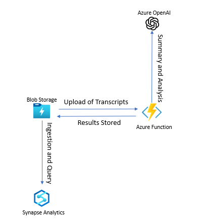

Call logs are uploaded to a designated location in Blob Storage. This upload will trigger the Azure Function which utilzies the [Azure OpenAI Service](https://azure.microsoft.com/en-us/products/cognitive-services/openai-service/) for summarization, sentiment analysis, product offering the conversation was about, the topic of the call, as well as a summary of the call. These results are written into a separate desginated location in the Blob Storage. From there, Synapse Analytics is utilized to pull in the newly cleansed data to create a table that can be queried in order to derive further insights. 

# Deployment

## Step 1. Blob storage and Azure Function app deployment
[](https://portal.azure.com/#create/Microsoft.Template/uri/https%3A%2F%2Fraw.githubusercontent.com%2Fmicrosoft%2FOpenAIWorkshop%2Fnicole-dev%2Fscenarios%2Fopenai_batch_pipeline%2Fdeploy%2Fazuredeploy.json)

>**Please Note:** Azure Open AI must be provisioned with one of the models being deployed. 

You will need to supply entries for 4 fields within the template:
* **OPENAI_API_KEY** - This is the API key for the Azure Open AI service
* **OPENAI_RESOURCE_ENDPOINT** - This is the resource endpoint for the Azure Open AI service
* **OPENAI_MODEL_NAME** - This is the name of the model being deployed
* **Resource group** - This is the resource group that will be created for the deployment (You can create a new one or use an existing one)

**OPENAI_API_KEY** and **OPENAI_RESOURCE_ENDPOINT** can be found by naviagting to Azure OpenAI service in the Azure portal 


**OPENAI_MODEL_NAME** can be found in the Azure OpenAI studio under the deplyment section


---

## Step 2. Ingest Data to Storage created in step 1

### a. Launch Azure Cloud Shell


### A filled out template would look like this:
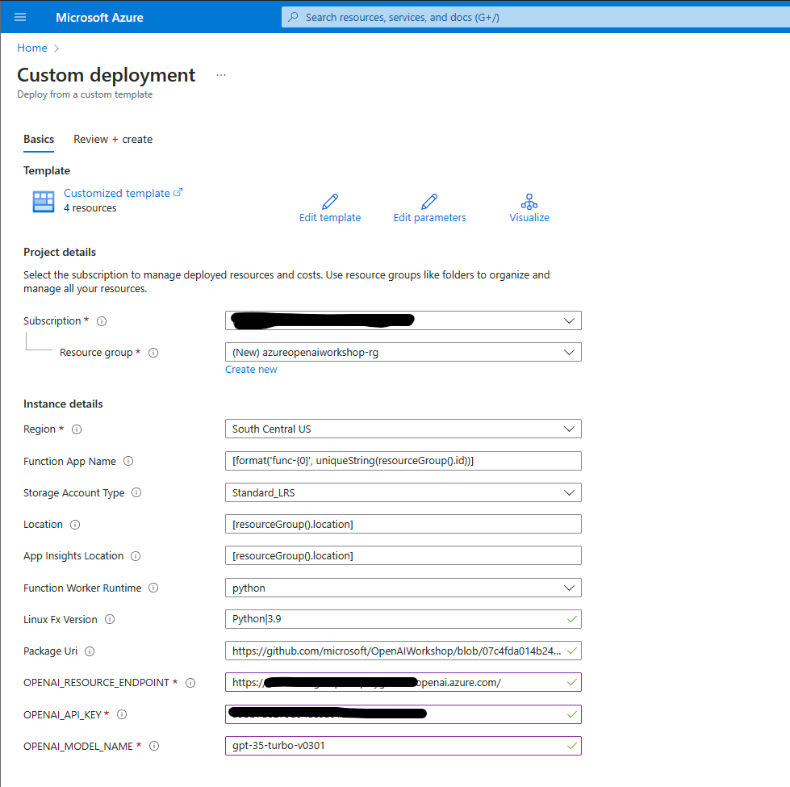

After clicking the blue **Review** **+** **create** button, wait to make certain the deployment passes the validation check and there are no errors or missing fields. Click **Create** to deploy the template; it will take approximately 2 or 3 minutes to fully deploy. Successful deployment will look like this:


### b. In the Cloud Shell run below commands:
> **Please Note:** The following commands are issued in Bash; please ensure you are using **Bash** in the Cloud Shell.
```bash 
    wget https://repo.anaconda.com/miniconda/Miniconda3-py39_23.1.0-1-Linux-x86_64.sh 
```

```bash 
    sh Miniconda3-py39_23.1.0-1-Linux-x86_64.sh 
```

Accept the agreement and install on the default path:

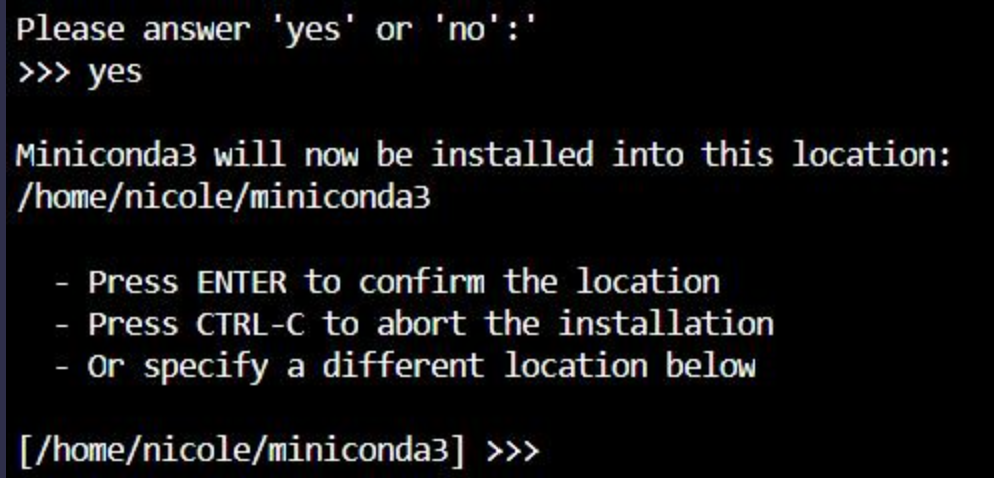

**Please Note:** If it asks to run conda init, type yes to confirm. 

```bash 
    export PATH=~/miniconda3/bin:$PATH
```

```bash 
    git clone https://github.com/microsoft/OpenAIWorkshop.git
    cd OpenAIWorkshop/scenarios/openai_batch_pipeline/document_generation
    conda create -n document-creation
    conda activate document-creation
    pip install -r reqs.txt
```
Locate the connection string for the storage account created in Step 1 in the Azure portal and the run the following command:


```bash 
    python upload_docs.py --conn_string "<CONNECTION_STRING>"
```


> **Please Note:** CONNECTION_STRING can be found by navigating to storage account  created in Step 1 in the Azure portal. Running the above command will upload the json files to the storage account and will take a few minutes to complete.

Once you have successfully uploaded the json files to the storage account, you can navigate to the storage account in the Azure portal and verify that the files have been uploaded.

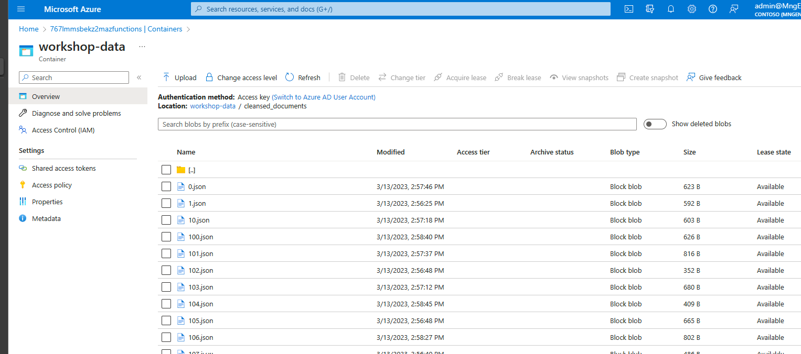

---

## Step 3. Set up Synapse Workspace

### **a. Create the Synapse Resource in your Resource Group**
Navitate to the Resource Group created in Step 1 and click **Create**, located in the top-left. This will bring you to the Marketplace. Search for **Synapse** and select **Azure Synapse Analytics**. Click **Create** in the lower-lefthand.

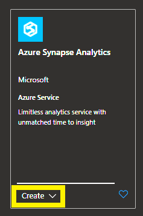

Fill out the template (sample filled out version below) - you will need to provide a **Workspace name**. If you have existing Data Lake Storage Gen2 or file system accounts, you can select them here. If you do not have existing accounts, you can create new ones. Click **Review + Create** in the bottom left.

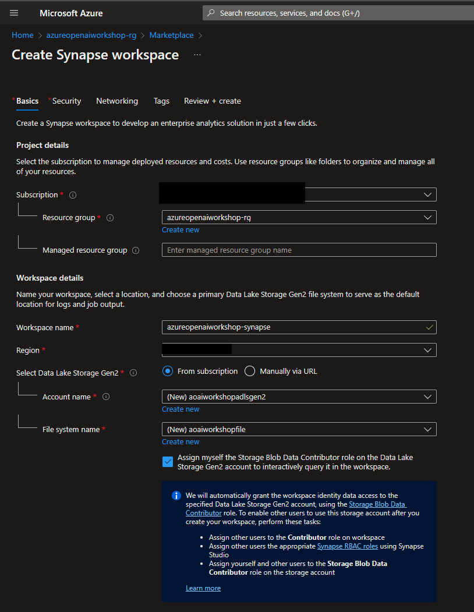

### **b. Create the Synapse SQL Pool**
Once the Synapse Workspace has been created, navigate to the Synapse Workspace in the Azure portal, and click to **Open** the **Azure Synapse Studio** in the **Getting started** section. This will open a new browswer window with the Synapse Studio.

Once in the Synapse Studio, on the left-hand side, click the tool-box icon (with the wrench sign) to open the **Manage** Options. At the top of the newly opened menu bar, under the **Analytics pools** section, click **SQL pools**. Then click **New** in the top-left.

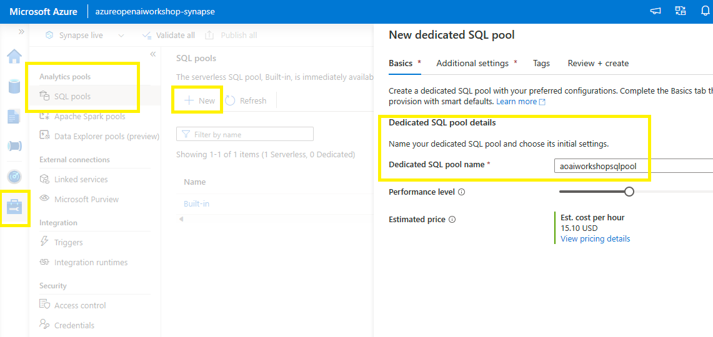

> **Please note:** You will need to supply a name for the Synapse SQL Pool. Accept all other defaults.

Accept the defaults and press **Review + Create** in the bottom left, then **Create** once it passes validation. It may take a moment for your SQL Pool to initialize. Once it is completed you will see this:


### **c. Create Target SQL Table**

Once the SQL Pool has been created, click into the **Develop** section of the Synapse Studio, click the "**+**" sign in the top-left, and select **SQL script**. This will open a new window with a SQL script editor. 


> **Please Note:** You will need to change the **Connect to** and **Use database** portions in the SQL editor to point towards the SQL Pool you created in the previous step.

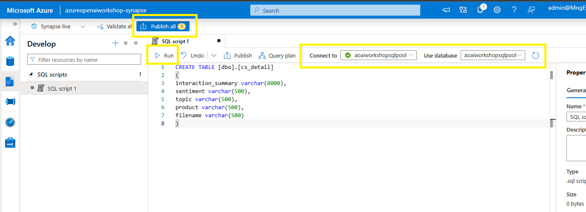

Copy and paste the following script into the editor and click the **Run** button in the top-left, as shown in the picture above.

```SQL 
CREATE TABLE [dbo].[cs_detail]
(
interaction_summary varchar(8000),
sentiment varchar(500),
topic varchar(500),
product varchar(500),
filename varchar(500)
)
 ```

Finish this step by pressing **Publish all** just above the **Run** button to publish our work thus far.

### **d. Create Source and Target Linked Services**

We'll next need to create two linked services: One for our Source (the JSON files in the Data Lake) and another for the Synapse SQL Database that houses the table we created in the previous step.

Click back into the **Manage** section of the Synapse Studio, and click the **Linked services** option under the **External connections** section. Then click **New** in the top-left.


Start by creating the Linked Services for the source of our data, the JSON files housed in the ADLS Gen2 storage we created with our initial template. In the search bar that opens after you click **New**, search for **blob** and click on Azure Blob Storage as depicted below:

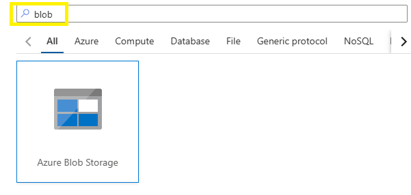

You will need to provide a **Name** for your Linked Service. Change the **Authentication type** to *System Assigned Managed Identity*. Then select the subcription you have been working in, finally selecting the **Storage account name** which you created in the initial template and loaded the JSON files into:

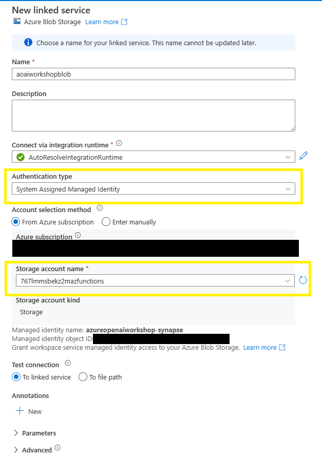

Click the **Create** button in blue on the bottom left of the New linked service window.

Next, we'll create the Linked Service to our Target table in our Synapse SQL Pool. Begin by clicking the **New** button in the *Linked services** section as we did in the step just previously for the Source. This time, however, search for "Synapse" and select **Azure Synapse Analytics**.


In the *New linked service* window that opens, fill in a **Name** for your target linked service. Select the **Azure subcription** in which you have been working and where you created your Synapse SQL Pool. Select the **Server name** and **Database name** which you created earlier and in which created the target table above. Be certain to change the **Authentication type** to *System Assigned Managed Identity*.

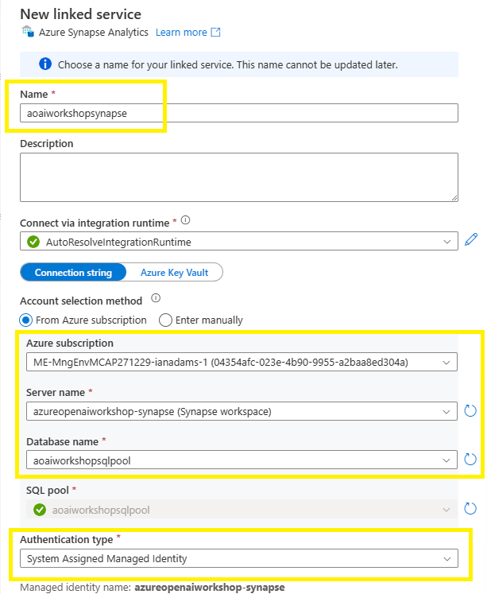

Once you have created the two Linked Services, be certain to press the **Publish all** button at the top to publish our work and finalize the creation of the linked services. After it is finished, you will see a screen similar to this:

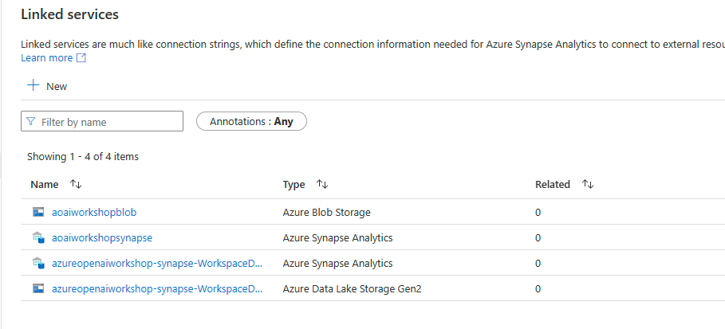

### **e. Create Synapse Data Flow**

While still within the Synapse Studio, we will now need to create a **Data flow** to ingest our JSON data and write it to our SQL Database. For the purposes of this workshop, this will be a very simple data flow that ingests the data, renames some columns, and writes it back out to the target table. 

First, we'll want to go back to the **Develop** tab, select **"+"**, and then *Data flow**


Once the data flow editor opens, click **Add Source**. A new window will open at the bottom of the screen, select "New" on the **Dataset** row while leaving the other options as default:


A new window should open on the right side of your screen. Next, select **Azure Blob Storage** (it is likely in the top, middle of the window), and then press **Continue**. On the following screen select the **JSON** option as our incoming data is in JSON format. Select the **Linked Service** we just set up in the steps above.

You will need to select the proper **File path** to select the Directory where our JSON files are stored. It should be something to the effect of "workshop-data / cleansed_documents". Click the **OK** button to close the window


Next, we'll need to move to the **Source options** panel and drop-down the **JSON settings** options. We need to change the **Document form** option to the *Array of documents* setting. This allows our flow to read each .json file as a separate entry into our database:

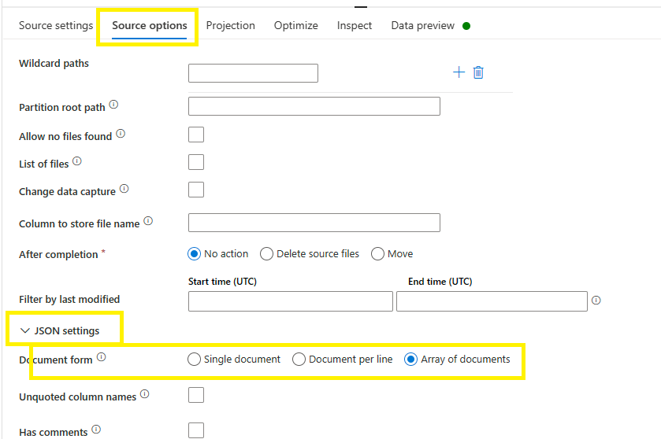

If you have turned on a *data flow debug* session, you can head to the **Data preview** tab and run a preview to check your work thus far:


Next we can add in our **Select** tile and do our minor alteration before writing the data out to the Synapse SQL table. To begin, click the small **+** sign next to our ingestion tile, and choose the Select option:

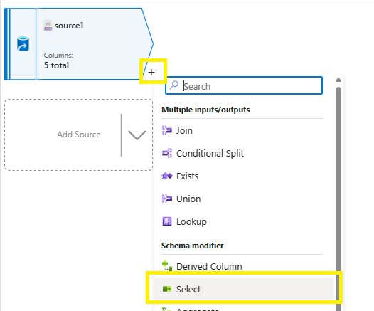

We can leave all the settings as default.

Next we'll add in our **Sink** tile. This is the step that will write our data out to our Synapse SQL database. Click on the small **+** sign next to our **Select** tile. Scroll all the way to the bottom of the options menu and select the Sink option:

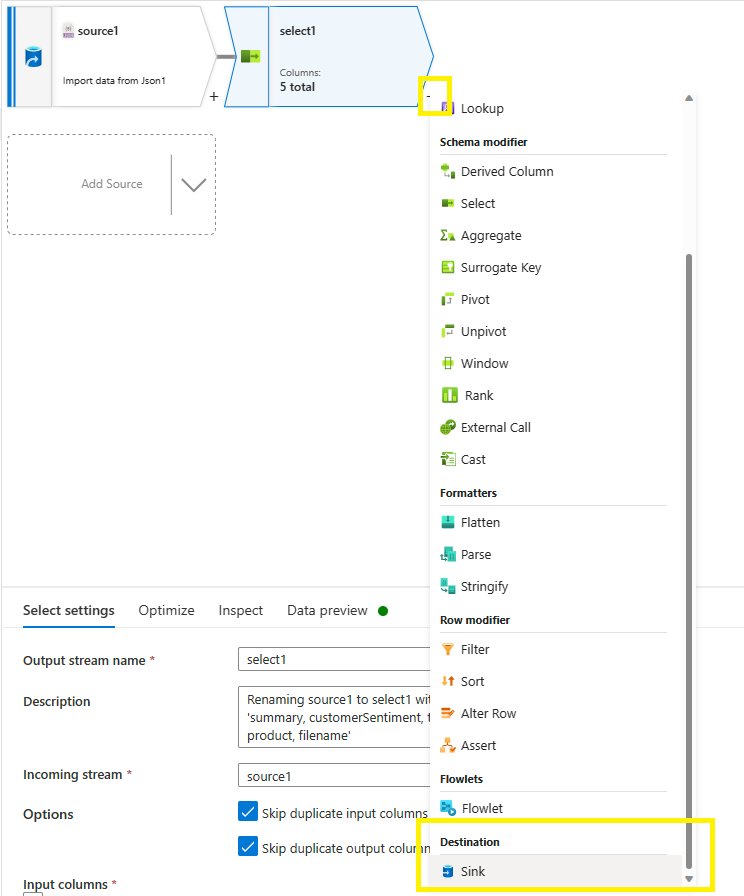

Once the **Sink** tile opens, choose **Inline** for the *Sink type*. Then select **Azure Synapse Analytics** for the *Inline dataset type* and the proper **Linked service** based on the name we assigned in our earlier step.

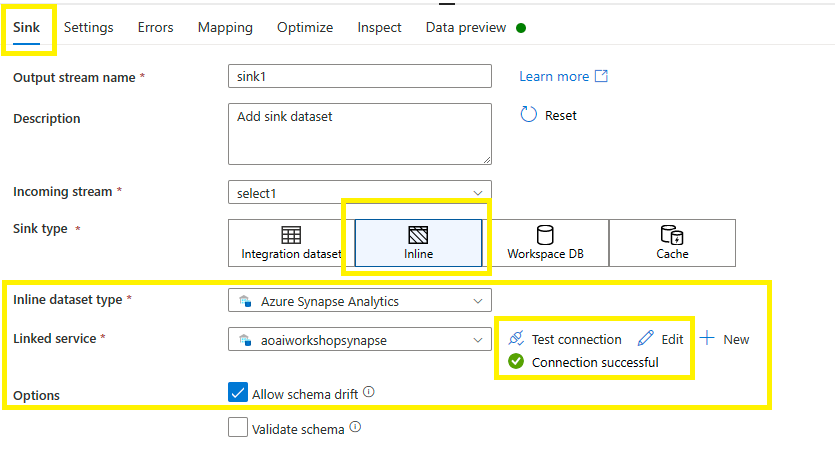

We will then need to head over to the **Settings** tab and adjust the **Scehma name** and **Table name**. If you utilized the script provided earlier to make the target table, the Schema name is **dbo** and the Table name is **cs_detail**.

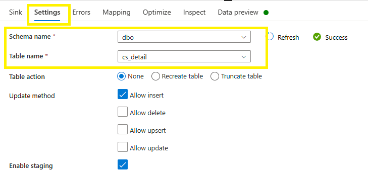

Before we finish our work in the data flow, we should preview our data:

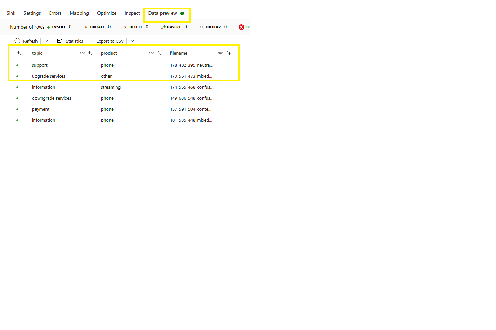

Previewing our data reveals we only have 3 columns when we are expecting a total of 5. We have lost our Summary and Sentiment columns. To correct this, let's use our **Select** tile to change the names of our columns to the expected output values:


If we return to our **Sink** tile and **Refresh** our **Data preview** we will now see our expected 5 columns of output:

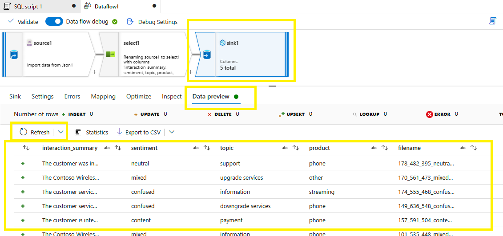

Once you have reviewed the data and are satisfied that all columns are mapped successfully (you should have 5 columns total, all showing data in a string format), we can press **Publish all** at the top to save our current configuration. A window will open at the right side of the screen - press the blue **Publish** button at the bottom left of it to save your changes.

Your completed and saved Data flow will look something like this:
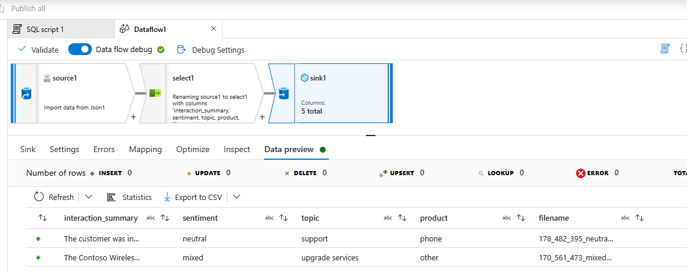

### **f. Create Synapse Pipeline**

Once we have created our **Data flow** we will need to set up a **Pipeline** to house it. To create a **Pipeline**, navigate to the left-hand menu bar and choose the **In tegration** option (it looks like a pipe). Then click the **+** at the top of the Integrate menu to **Add a new resource** and choose **Pipeline**:

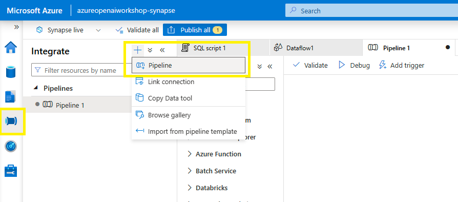

Next, we need to add a **Data flow**


Create a pipeline to trigger the ingestion.


Trigger the run and query the target table after successful completion of the pipeline.


## Step 4. Test

Now that the data is in the target table it is available for usage by running SQL queries against it, or connecting PowerBI and creating visualizations. The Azure Function is running as well, so try uploading some of the transcript files to the generated_documents folder in your container and see how the function processes it and creates a new file in the cleansed_documents file.

Here is a query to get started:

 ```sql 
SELECT sentiment, count(*)
FROM [dbo].[cs_detail]
GROUP BY sentiment
ORDER BY count(*) desc      
 ```

