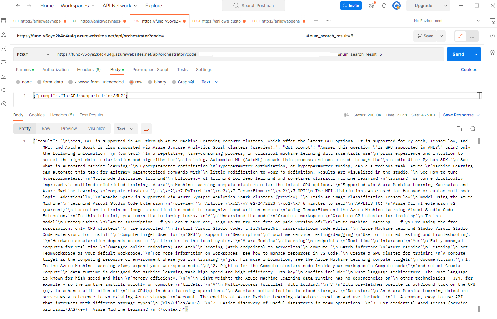
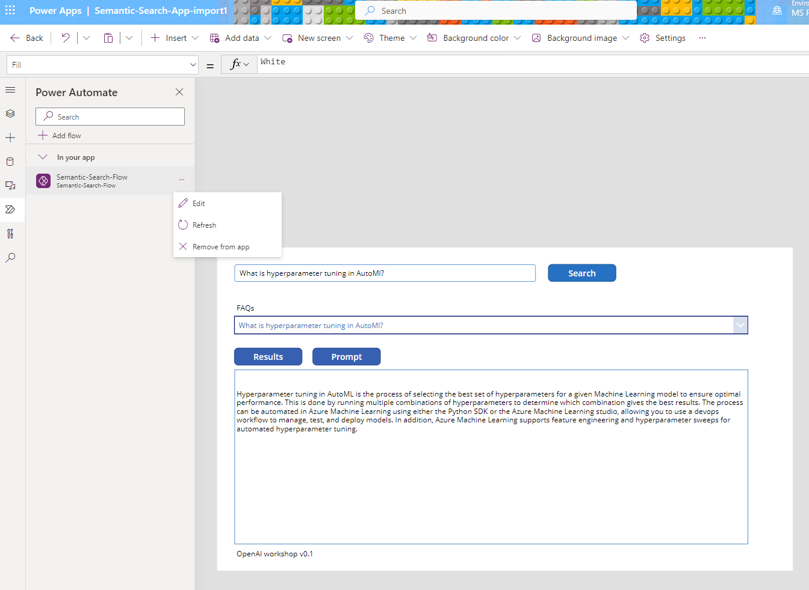
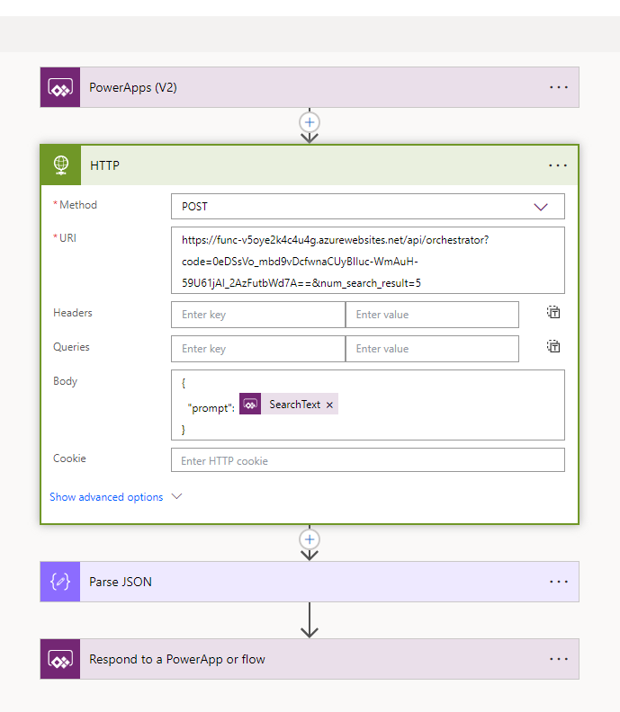

# Using Azure OpenAI on custom dataset
### Scenario summary:
This scenario allows use cases to use Open AI as an intelligent agent to answer questions from end users or assist them using knowledge of a proprietary corpus and domain.
Applications can be: 
- Giving direct answer to questions about specific product, service and process based on a knowledge corpus that can be updated frequently. This is an alternative to classic search where the result are just documents with relevant information to the question. Think of this as Bing Chat on proprietary data.
- Giving recommendation & assistance: based on information that can be implicitly gathered about the user, formulate useful content for the user's purpose. For example, a travel website may utilize users' personal information, past posts and transaction history to personalize recommendations when users need to be helped with creating next trip idea/itinerary

Regardless of the application scenario, the solution flow is:
- Step 1 prepare the context information: context information can be retrieved from proprietary knowledge corpus and other systems based on the user's query and user's information. The retrieval mechanism can be a semantic search engine to retrieve right content for unstructured data corpus or SQL query in case of structured dataset.
- Step 2 fomulate prompt to Open AI: from the context and depending on the goal of user, formulate GPT prompt to get the final response to end user. For example, if it's knowlege retrieval vs. recommendation

This implementation scenario focuses on building a knowledge retrieval chatbot application on top of unstructured data corpus but the same design can be used for recommendation & generative scenarios.

### Architecture Diagram

From the user's query, the solution uses two-stage information retrieval to retrieve the content that best matches the user query. 
In stage 1, full text search in Azure Cognitive Search is used to retrieve a number of relevant documents. In stage 2, the search result is applied with pretrained NLP model and embedding search to further narrow down the the most relavant content. The content is used by orchestrator service to form a prompt to OpenAI deployment of LLM. The OpenAI service returns result which is then sent to Power App client application.
### Deployment

### Prerequisites

* [PostMan Client Installed](https://www.postman.com/downloads/) 
* Azure Cloud Shell is recommended as it comes with preinstalled dependencies. 

## 1. Azure services deployment

Deploy Azure Resources namely - Azure Function App to host facade for OpenAI and Search APIs, Azure Search Service and a Azure Form Recognizer resource.
The Azure Function App also deploys the function code needed for powerapps automate flow. 

- Step 1: Setup Azure Cognitive Search and prepare data

    As part of data preperation step, to work in Open AI, the documents are chunked into smaller units(20 lines) and stored as individual documents in the search index. The chunking steps can be achieved with a python script below. 
    To make it easy for the labs, the sample document has already been chunked and provided in the repo. 

    * Enable Semantic Search on Azure Portal. Navigate to Semantic Search blade and select Free plan. 
    
        

    *   Create Search Index, Sematic Configuration and Index a few documents.
        Run the below commands from cmd prompt to conifgure python environment. 

            
            git clone <repo>
            cd OpenAIWorkshop\scenarios\openai_on_custom_dataset
            conda create env -n openaiworkshop python=3.9
            conda activate openaiworkshop
            pip install -r .\orchestrator\requirements.txt

    *   To configure Azure Search manully without using the above python approach, please follow the steps below

        - In the storage container, that is created as part of the template in step 1, create a blob container. 
        - Upload the data files in the ./data-files folder in this folder to the blob container using Azure Portal UI.
        - Import data in Azure Search as shown below. Choose the blob container and provide the blob-folder name in to continue. 

            
        - In the Customize Target Index, use id as the Azure Document Key and mark text as the Searchable Field. 
        - This should index the chunked sample

    *   Update Azure Search, Open AI endpoints, AFR Endpoint and API Keys in the secrets.env. 
        Rename secrets.rename to secrets.env. (This is recommended to prevent secrets from leaking into external environments.)
        The secrets.env should be placed in the ingest folder along side the python script file search-indexer.py.

            AZURE_OPENAI_API_KEY=""
            AZURE_OPENAI_ENDPOINT="https://<>.openai.azure.com/"
            AZURE_OPENAI_API_KEY_EASTUS=""
            AZURE_OPENAI_ENDPOINT_EASTUS="https://<>.openai.azure.com/"

            AZSEARCH_EP="https://<>.search.windows.net/"
            AZSEARCH_KEY=""
            AFR_ENDPOINT="https://westus2.api.cognitive.microsoft.com/"
            AFR_API_KEY=""
            INDEX_NAME="azure-ml-docs"

    *   This is an optional step. The document processing, chunking, indexing can all be scripted using any preferred language. 
        This repo uses Python. Run the below script to create search index, add semantic configuration and populate few sample documents from Azure doc. 
        The search indexer chunks a sample pdf document(500 pages) which is downloaded from azure docs and chunks each page into 20 lines. Each chunk is created as a new seach doc in the index. The pdf document processing is achieved using Azure Form Recognizer service. 
     

            cd .\scenarios\openai_on_custom_dataset\ingest\
            python .\search-indexer.py
            
        

## Step 2: Automated orchestrator service with Azure Function App

    Update the below configuration in Azure Function App configuration blade. 

            {
                "name": "GPT_ENGINE",
                "value": "text-davinci-003",
                "slotSetting": false
            },
            {
                "name": "INDEX_NAME",
                "value": "azure-aml-docs",
                "slotSetting": false
            },
            {
                "name": "OPENAI_API_KEY",
                "value": "<>",
                "slotSetting": false
            },
            {
                "name": "OPENAI_RESOURCE_ENDPOINT",
                "value": "https://<>.openai.azure.com/",
                "slotSetting": false
            },
            {
                "name": "SEMANTIC_CONFIG",
                "value": "semantic-config",
                "slotSetting": false
            }

## Step 3. Test Azure service deployment

    Launch Postman and test the Azure Function to make sure it is returning results. 

    

## Step 4. Deploy client Power App

    Navigate to https://make.powerapps.com/ and click on Apps on the left navigation. 

    

    From the top nav bar, click Import Canvas App and upload the Semantic-Search-Package.zip file from this git repo path. 

    

    

    Click on Import to import the package into powerapps environment. 

    

    This will import the Power App canvas app and Semantic-Search Power Automate Flow into the workspace. 
    
    

    Edit the Power Automate Flow and update Azure Function Url. 
    
    

## Step 5. Test

    Click on the play button on the top right corner in the PowerApps Portal to launch PowerApp.
    Select an  FAQ from dropdown and click Search. This is should bring up the answers powered by Open AI GPT-3 Models. 

